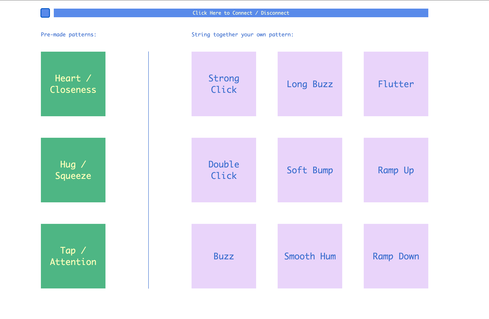
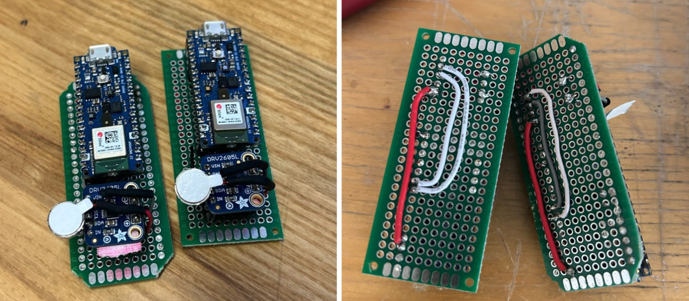

**Haptics + GUI Research Snack TO-GO**

**Overview**
- This project is a p5.js GUI that sends simple numeric "pattern" commands over BLE from the web to a microcontroller which drives an Adafruit DRV2605L haptic motor driver. Pressing buttons on the GUI corresponds to output vibrations from the DRV2605L driver library. This is different to what I demoed in class -- this is a simpler version and requires fewer parts (parts list should be borrowable). It utilizes p5.js and BLE material that DF students should find familiar from past coursework (this will be a challenging project to recreate without previous experience with Bluetooth or p5.js). The focuses of this project are designing GUI -> output on vibration motor and exploring the DRV2605L haptic motor driver library.

**Materials**
- **Haptic driver:** Adafruit DRV2605L haptic motor driver highly reccomended and is used in this project
- **Microcontroller with BLE:** ex. Arduino Nano 33 BLE / Nano BLE Sense (I used Arduino Nano Sense for this project) -- CPX does not have Bluetooth capabilities as-is!!
- **Screen:** Laptop, tablet, or desktop to run the p5.js GUI in a supported browser (I use Chrome -- note that BLE is unsupported generally on mobile devices)
- **Vibration motor(s):** Coin or eccentric rotating mass (ERM) / LRA motors compatible with the driver (I used the same mini ERM pancake motor from Kate's haptics class)
- **Power & wiring:** Appropriate power supply / wiring to the driver and motors (this can be a 5V battery, powered from your computer, or powered through an outlet)

**Previous experience suggested**
- **p5.js & Web Bluetooth:** Intermediate to advanced — comfortable editing sketches, adding UI, and understanding how Web Bluetooth pairs and writes to characteristics.
- **Physical computing / electronics / microcontrollers:** Intermediate — comfortable using the Arduino IDE, flashing sketches, and reading Serial output for debugging. Also soldering, powering motors safely, and understanding power/current limits.
- **Adafruit DRV2605L haptic driver:** Beginner-level — don't necessarily need previous experience (the datasheet is very helpful to geet started), but basic familiarity with the Adafruit library and playing built-in waveforms is helpful.

**Wiring & Notes**
 - Connect the haptic motor driver to your microcontroller per the driver's datasheet (I2C/SPI/power lines as required).
 - Ensure the microcontroller's code advertises a BLE service and characteristic matching the UUIDs in `sketch.js`.
 - The example Arduino sketch for this project is in the .ino file — adapt the pin and I2C settings to your board.

Kate's Haptics lecture slides have better & more detailed examples of circuits with the haptic motor driver!

**How to use (quick rundown)**
- Serve the project from localhost (or via the p5.js web editor). Web Bluetooth requires a secure context (https) or localhost.
- Open the page in Chrome (desktop) or another Web Bluetooth-capable browser.
- Click the "Click Here to Connect / Disconnect" button. The browser will open a device picker — select your microcontroller (the advertised name shown by your board).
- After selecting the device the sketch will discover the service/characteristic (ensure the UUIDs in sketch.js match your firmware). The UI will update to show a successful connection.
- Use the GUI pattern buttons to send pattern numbers to the microcontroller. Each button sends the configured payload (see sketch.js for the exact format); the microcontroller should parse that and drive the DRV2605L accordingly.
- Monitor feedback: check the browser console for send/receive logs and the Arduino Serial Monitor for incoming commands and debug messages.
- To disconnect, click the same connect button; the sketch will close the BLE connection and update UI state.
- Quick troubleshooting:
    - Confirm service/characteristic UUIDs match between sketch.js and the Arduino .ino.
    - Ensure the microcontroller is powered and advertising BLE (no other device paired to it).
    - Use localhost or HTTPS—Web Bluetooth will not work from plain http on remote hosts.
    - If patterns don’t trigger, check motor wiring, power limits, and the DRV2605L library usage on the microcontroller.
- For deeper debugging, add console.log calls in sketch.js and Serial.prints in the .ino to inspect exact payloads being sent and received.

**Code Files Overview**
    - **index.html** — Loads p5.js and the UI markup (connect button, pattern buttons). Includes scripts.
    - **sketch.js** — Main p5.js sketch + all Web Bluetooth logic (connect/disconnect, characteristic discovery, sending pattern commands, UI state updates).
    - **style.css** — Layout and simple responsive styles for the GUI (button sizes, connection indicator).
    - **HapticDriverBLE.ino** — Arduino/microcontroller code: advertises BLE service/characteristic, parses incoming commands, drives the DRV2605L, and prints debug to Serial.

**BLE UUIDs**
- Default values used in the sketch (change as required to match your microcontroller code):
  - Service: `19b10000-e8f2-537e-4f6c-d104768a1214`
  - Characteristic: `19b10001-e8f2-537e-4f6c-d104768a1214`

**Helpful links**
- Adafruit DRV2605L guide (product + learn guide): https://learn.adafruit.com/adafruit-drv2605-haptic-controller-breakout/overview
- DRV2605 datasheet: https://learn.adafruit.com/adafruit-drv2605-haptic-controller-breakout/downloads
- p5.js (reference & tutorials): https://p5js.org/
- p5.ble (Web Bluetooth helper for p5): https://itpnyu.github.io/p5ble-website/
- Web Bluetooth API (MDN): https://developer.mozilla.org/en-US/docs/Web/API/Web_Bluetooth_API
- ArduinoBLE library (reference): https://docs.arduino.cc/libraries/arduinoble/
- Arduino Nano 33 BLE / Nano 33 BLE Sense guide: https://docs.arduino.cc/hardware/nano-33-ble/
- Web Bluetooth troubleshooting and Chrome tips: https://developer.chrome.com/docs/capabilities/bluetooth
